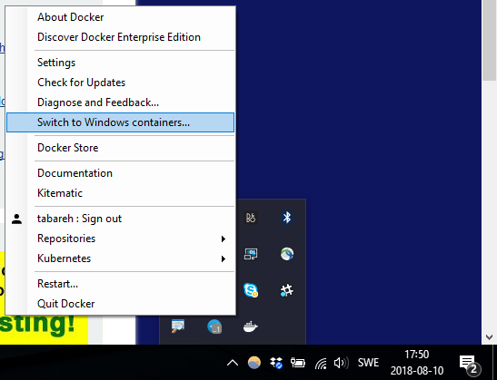

# Instructions
* Make sure you have the docker container for windows installed and you're using linux images (the docker tray menu should show 'Swith to Windows containers'. DO NOT Switch to Windows)
  

  
* Make sure the ports used in docker-compose.yml is free on your computer
* run this command: ``` docker-compose -f docker-compose.yml up -d --build```
* check if you have all three docker containers up and running
    * rabbitmq
    * publisher
    * subscriber (in case of issues with subscriber container check the point below under To do)
* Once all are up and running, view the container log of the subscriber using a similar command:```docker logs -f <container_name>```
* Then in another window, attach shell to publisher container interactively using a similar command:```docker exec -it <container_name> /bin/sh```
* In the attached shell run the publisher with dotnet command: ```dotnet publish.dll```
* The program asks you for a message to send repeatedly. Each time you send a message, it will be sent to rabbitmq queue
* Check the logs of the subscriber container, you should be able to see all the messages you sent.


# To do:
* ~~POC RabbitMQ on container~~
* ~~Review pluralsight course~~
* ~~POC publisher with MassTransit~~
* ~~POC subscriber with MassTransit~~
* ~~Containerize all microservices~~
* Connection resiliency
    * if the subscriber container fails to start, it's because rabbitmq has not started up completely. Remove (and NOT stop) only the subscriber container and run the docker-compose again 

# Notes:
- It's easier to use VS Code docker extension by Microsoft for all the actions with containers in the instructions above.
- This project is inspired by :
    -    http://looselycoupledlabs.com/2015/07/masstransit-3-update-a-simple-publishsubscribe-example/
